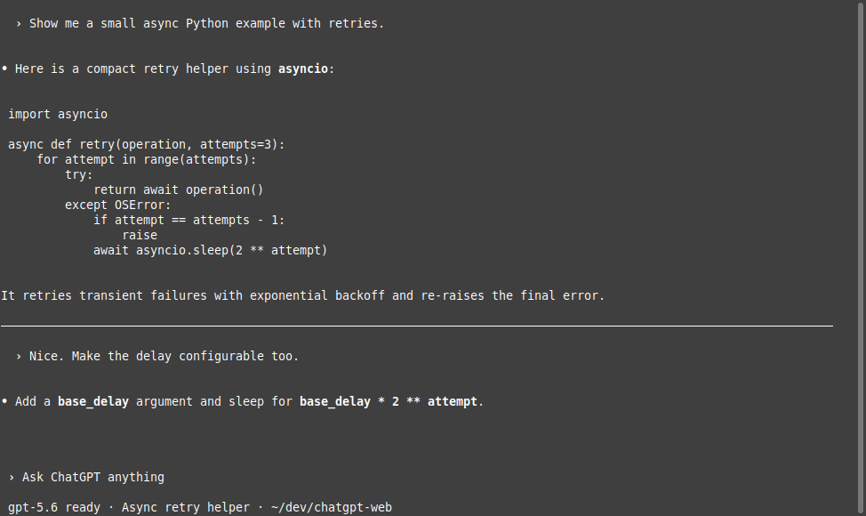
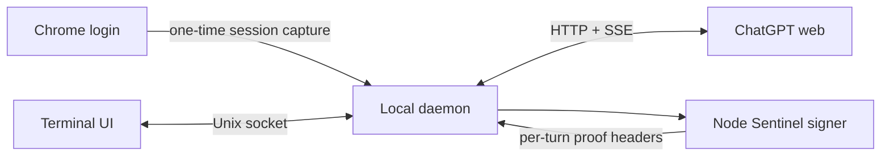

# 🌸 chatgpt-web

> A fast, Codex-inspired terminal client for your ChatGPT conversations.

`chatgpt-web` connects to an authenticated ChatGPT web session and brings it to
the terminal: streaming answers, searchable history, Markdown rendering,
syntax-highlighted code, native scrollback, and a bottom composer that feels at
home beside modern coding agents.

<p align="center">
  
</p>

> [!IMPORTANT]
> This is an experimental, unofficial client for undocumented ChatGPT web
> endpoints. It may stop working when the web application changes. It is not an
> OpenAI API client and is not affiliated with or endorsed by OpenAI.

## ✨ Highlights

- 🖥️ **Codex-style terminal UI** with a full viewport and bottom composer
- ⚡ **Streaming responses** with responsive input while generation continues
- 🔎 **Searchable resume picker** for recent conversations
- 🧠 **Persistent authentication** after a one-time interactive Chrome login
- 🚀 **Browserless operation** after authentication, including write signing
- 🎨 **Rich Markdown** with syntax-highlighted fenced code blocks
- 🖼️ **Clipboard images** uploaded and attached directly from the composer
- 📜 **Native terminal scrollback** bounded to the current session
- ↔️ **Resize-aware history** that reflows completed turns to the new width
- 🧹 **Clean history rendering** that hides internal tool-protocol payloads
- 📋 **Clipboard support** through `/copy`
- 🪶 **Zero manual environment setup** when launched with `uv`

## 🚦 Quick start

### Requirements

- Python 3.10+
- [`uv`](https://docs.astral.sh/uv/) (recommended), or `pip`
- Node.js 22+
- Chrome or Chromium for the initial login
- `wl-paste` (Wayland), `xclip` (X11), or `pngpaste` (macOS) for image paste

```bash
git clone https://github.com/tritao/chatgpt-web.git
cd chatgpt-web

# Open a dedicated Chrome profile and log in to ChatGPT.
./run login

# Capture the authenticated session, then launch the terminal UI.
./run auth
./run
```

Chrome can be closed after `auth` succeeds. The local daemon persists the
session and performs subsequent reads and writes without a running browser.

To make the command available everywhere:

```bash
mkdir -p ~/.local/bin
ln -s "$(pwd)/run" ~/.local/bin/chatgpt-web
```

## 🎮 Terminal controls

| Key | Action |
| --- | --- |
| `Enter` | Send the prompt |
| `Alt+Enter` | Insert a newline |
| `Ctrl+R` | Open the searchable conversation picker |
| `Ctrl+V` | Attach a PNG image from the clipboard |
| `Ctrl+C` | Clear the prompt, or stop an active response |
| `Ctrl+D` | Exit from an empty prompt |
| `PageUp` / `PageDown` | Move through the transcript |
| `End` | Follow new output at the bottom |
| `Tab` / `Enter` | Accept a slash-command completion |
| `Escape` | Close autocomplete or the resume picker |

Type `/` to open command completion:

| Command | Action |
| --- | --- |
| `/new` | Start a new conversation |
| `/resume` | Search recent conversations |
| `/resume ID` | Open a conversation directly |
| `/history` | Reload the current conversation |
| `/rename TITLE` | Rename the current conversation |
| `/copy` | Copy the latest assistant response |
| `/remove` | Remove the latest pending image |
| `/clear` | Clear the displayed transcript |
| `/help` | Show command help |
| `/exit`, `/quit` | Exit the client |

## 🧰 Command-line usage

The same session can be used without the interactive UI:

```bash
./run list
./run list --limit 100
./run list --all --output jsonl
./run show CONVERSATION_ID
./run rename CONVERSATION_ID "New title"
./run new "Explain monads in one paragraph"
./run send CONVERSATION_ID "Continue with an example"
./run resume CONVERSATION_ID
./run status
./run stop
./run logout
```

## 🏗️ How it works



1. `login` starts Chrome with a dedicated, persistent profile.
2. `auth` captures the authenticated browser session through local Chrome
   DevTools Protocol and stores it in a mode-`0600` state file.
3. A local daemon serves CLI invocations through a mode-`0600` Unix socket.
4. Python performs conversation reads, writes, and SSE streaming directly.
5. The Node helper evaluates ChatGPT's current Sentinel proof and `dx`
   interpreters to produce per-turn write headers.

The Chrome process is therefore an authentication and compatibility bootstrap,
not a permanent transport dependency.

## 🔐 Local data and security

The saved session grants access to your ChatGPT account and must be treated like
a password.

| Data | Default location | Permissions |
| --- | --- | --- |
| Chrome profile | `~/.local/share/chatgpt-web/chrome-profile` | directory `0700` |
| Saved session | `~/.local/state/chatgpt-web/session.json` | file `0600` |
| Sentinel cache | `~/.cache/chatgpt-web/sentinel` | directory `0700`, files `0600` |
| Daemon socket | `$XDG_RUNTIME_DIR` | file `0600` |

Authentication headers and cookies move from the Chrome helper to the daemon
through a pipe and are never printed. Run `./run logout` to stop the daemon and
delete the saved credential file.

## ⚙️ Configuration

| Variable | Purpose |
| --- | --- |
| `CHATGPT_WEB_MODEL` | Model label shown by the terminal UI |
| `CHATGPT_WEB_CDP_URL` | Chrome DevTools URL when it is not on the default port |
| `CHATGPT_WEB_SEND_MODE=recipe` | Use Chrome to construct a request recipe |
| `CHATGPT_WEB_SEND_MODE=chrome` | Use the legacy browser-driven sender |

The direct sender does not retry HTTP `429` responses or unavailable composers.
This avoids retry loops that can extend a rate limit.

## 🧪 Development setup

The `run` launcher uses the PEP 723 metadata embedded in `chatgpt-web` and lets
`uv` create and cache the Python environment automatically. To install
dependencies manually:

```bash
python -m venv .venv
. .venv/bin/activate
pip install -r requirements.txt
./chatgpt-web --help
```

The browser-facing endpoints and Sentinel implementation are undocumented and
change without notice. Compatibility fixes should preserve the browser login
fallback and must never log captured credentials or proof tokens.

## ⚠️ Project status

This project is suitable for experimentation on your own account. Expect
occasional breakage, rate limits, forced reauthentication, and protocol changes.
For supported integrations and production applications, use the official OpenAI
API instead.
